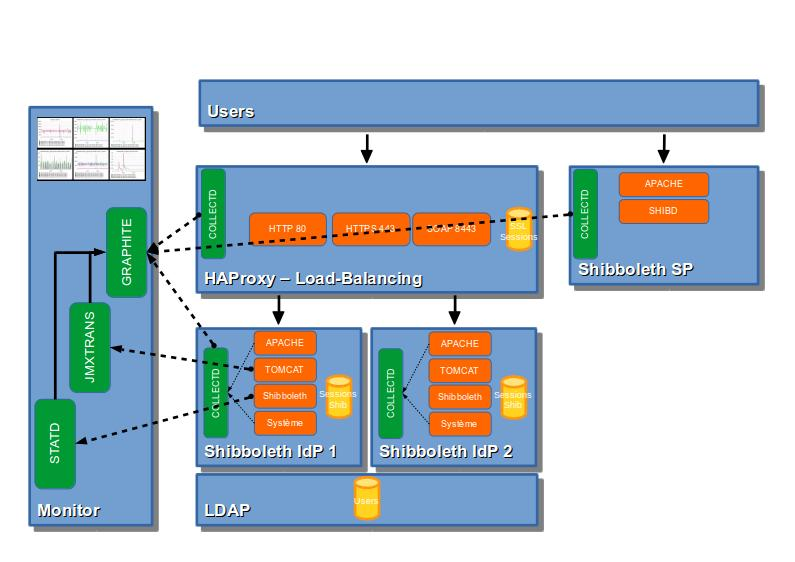
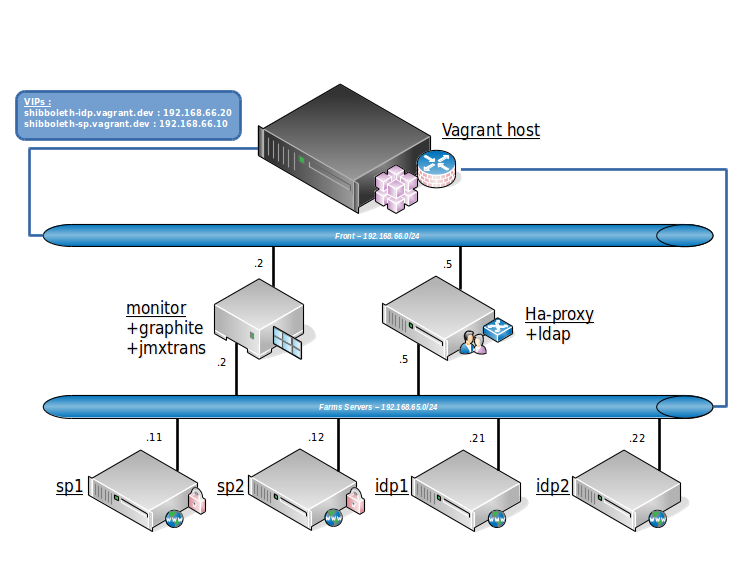

# Shibboleth Vagrant

Get an instance of [Shibboleth](https://shibboleth.net/products/identity-provider.html) SP and Idp up and running using Vagrant and Puppet.

## Getting started

Before you start, ensure you have [VirtualBox](https://www.virtualbox.org/wiki/Downloads) and [Vagrant](http://www.vagrantup.com/) installed and working.

* Install [librarian-puppet](https://github.com/rodjek/librarian-puppet) installed to manage puppet modules.
* Install Vagrant [landrush](https://github.com/phinze/landrush) plugin to manage DNS entries

1. `git clone https://github.com/ssejourne/shibboleth-vagrant.git`
2. `cd shibboleth-vagrant/puppet-contrib && librarian-puppet update && cd ..`
2. `vagrant up`

That's it! The VM will be created and Puppet will download and configure shibboleth for you.

You can check to make sure everything worked by visiting: https://shibboleth-idp.vagrant.dev/idp/status

Test it by starting to log in https://shibboleth-sp.vagrant.dev/secure

## Network Diagram

## Servers

### IDP - shibboleth-idp.vagrant.dev

* URLs
  * https://shibboleth-idp.vagrant.dev/idp/status
  * https://shibboleth-idp.vagrant.dev/idp/profile/Metadata/SAML : Metadataprovider

### SP - shibboleth-sp.vagrant.dev

* URLs
  * https://shibboleth-sp.vagrant.dev/secure : Content we want to secure (apache defined)
  * https://shibboleth-sp.vagrant.dev/Shibboleth.sso/Login : Content we want to secure (shibd defined)
  * https://shibboleth-sp.vagrant.dev/Shibboleth.sso/Metadata : SP Metadata generator
  * https://shibboleth-sp.vagrant.dev/Shibboleth.sso/Status : Display SP status
  * https://shibboleth-sp.vagrant.dev/Shibboleth.sso/Session : Display SP sessions
  * https://shibboleth-sp.vagrant.dev/Shibboleth.sso/DiscoveryFeed : ...

### LDAP
The ldap is on the ha-proxy server and accounts can be managed with an LDAP Account Manager on shibboleth-sp.vagrant.dev

* URL (LDAP Account Manager) : https://shibboleth-sp.vagrant.dev/lam
  * LDAP Account Manager admin user : lam / lam
* LDAP Manager : admin / vagrant
* Logins password are login with '123' at the end

### HAPROXY

* URLs
  * http://ha-proxy.vagrant.dev/haproxy?stats

### MONITOR

* Graphite + collectd + jmxtrans
* URLs
  * http://monitor.vagrant.dev/dashboard/ : Dashboards
  * http://monitor.vagrant.dev/render?target=collectd.ha-proxy_vagrant_dev.interface-eth1.*.*&format=csv : Export some data in CSV (or &format=json for JSON)

